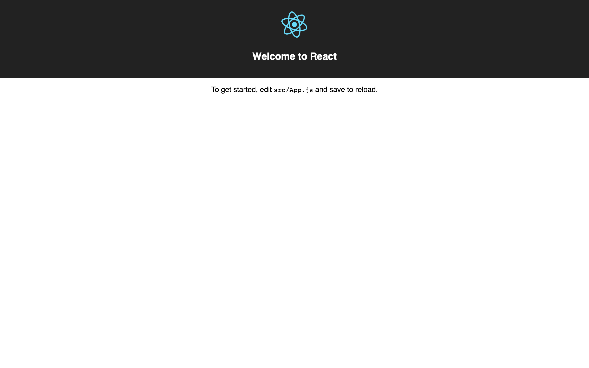

# Making interactive graphics with D3 and React
An original tutorial for [Journocoders London](https://www.meetup.com/Journocoders/), October 12, 2017.

🚶 David Blood/[@davidcblood](https://twitter.com/davidcblood)/[first] dot [last] at ft.com

## Introduction

Thanks for joining us at this month's Journocoders. We're going to build an interactive data visualisation using two of the world's most popular [JavaScript libraries](https://en.wikipedia.org/wiki/JavaScript_library):

* 📊 [D3.js](https://d3js.org/) is a library that's widely used for building data visualisations. It enables you to [bind data](https://github.com/d3/d3-selection/blob/master/README.md#joining-data) to web elements (usually [SVG](https://developer.mozilla.org/en-US/docs/Web/SVG) elements) then control how those elements look based on properties of the bound data. D3 was created by [Mike Bostock](https://twitter.com/mbostock), a former New York Times graphics editor, and is probably the only really indispensable tool for making online dataviz.
* ⚛ [React](https://facebook.github.io/react/) is a library for building user interfaces (UIs) from self-contained components that automatically update with changes to their underlying data. This component-based approach makes React a popular choice for building anything from basic interactive components all the way up to whole apps. React was created by Facebook, which [looked to be problematic](https://medium.com/@raulk/if-youre-a-startup-you-should-not-use-react-reflecting-on-the-bsd-patents-license-b049d4a67dd2) but [doesn't so much anymore](https://code.facebook.com/posts/300798627056246/relicensing-react-jest-flow-and-immutable-js/).

A selection of D3 + React examples can be found [here](https://react.rocks/tag/D3).

We'll use React to build a simple app featuring a D3 chart with dynamic filters and transitions. This is not an advanced D3 tutorial; instead, the aim is to explore some of the possibilities for interactive development offered by this powerful combination of tools.

### Why React?
There are plenty of reasons why so many developers choose to use React, many of which have to do with the workflow it enables rather than any specific features of the library itself. Three of the best ones are:
* It's component-based and pluggable: React makes it easy to compose complex UIs from simple components, plug individual components into existing apps or integrate them with other technologies.
* It introduces [JSX](https://reactjs.org/docs/introducing-jsx.html): JSX is a syntax for writing HTML-like markup in JavaScript files, which is ultimately rendered by React as regular HTML.
* It utilises a virtual DOM: React minimises slow UI updates by comparing the current state of your page structure — specifically, its [document object model](https://developer.mozilla.org/en-US/docs/Web/API/Document_Object_Model), or DOM — to a new, desired state and determines the most efficient way to update the DOM in order to achieve this state.

## Before you start
You'll need to ensure you have the software below installed and working. Mac users may wish to install [Homebrew](https://brew.sh/), which will make it quicker and easier to install most of these requirements. I'm assuming Linux users have all this stuff squared away.

### A terminal emulator
| macOS                                    | Windows                                  |
| ---------------------------------------- | ---------------------------------------- |
| [iTerm2](https://www.iterm2.com/index.html) | [cmder](http://cmder.net/) (download the ‘full’ as opposed to the ‘mini’ version, as it includes Git) |

### Git
| macOS                      | Windows                                  |
| -------------------------- | ---------------------------------------- |
| [Git]()/`brew install git` | [Git]() (unnecessary if you installed the full version of cmder) |

### Node.js
| macOS                                    | Windows                                  |
| ---------------------------------------- | ---------------------------------------- |
| [Node.js](https://nodejs.org/en/download/)/`brew install node` | [Node.js](https://nodejs.org/en/download/) |

### A code editor
| macOS                                    | Windows                                  |
| ---------------------------------------- | ---------------------------------------- |
| [Atom](https://atom.io/)/`brew cask install atom` | [Atom](https://atom.io/)                 |
| [Sublime Text](https://www.sublimetext.com/3)/`brew cask install sublime-text` | [Sublime Text](https://www.sublimetext.com/3) |

## Up and running
Open a terminal and run the command

`cd ~`

Now run

`git clone https://github.com/davidbjourno/making-interactive-graphics.git`

followed by

`cd making-interactive-graphics`

This'll pull down the tutorial project from GitHub into your home directory and ensure you're working in the project directory. The project requires several Node software packages to be installed before it'll work, so install them all using [npm](https://www.npmjs.com/) by running

`npm install`

When NPM has finished installing the project dependencies, run

`npm start`

to start a local web server, then navigate to `localhost:3000` in a browser. You should see this page:



This is a simple React app rendering a logo, header and paragraph of text.

The boilerplate code for this project was created by a tool called [Create React App](https://github.com/facebookincubator/create-react-app), which generates a project structure containing everything we need to start developing with React. It doesn't include D3, though, so we'll need to install that using npm. While we're at it, let's also install [React-Bootstrap](https://react-bootstrap.github.io/), so our page elements will be styled with [Bootstrap](https://getbootstrap.com/) CSS:

`npm install --save d3 react-bootstrap bootstrap@3`

Open the project directory in your code editor (either Atom or Sublime Text) and open the file `src/index.js`. Include the Bootstrap CSS in your app by inserting this at line 4:

```javascript
import 'bootstrap/dist/css/bootstrap.css';
```

At this point, you're ready to start writing React code.

## The App component
**If at any point you need to compare your code to a completed version of the tutorial project, you can view all the files [here](https://github.com/davidbjourno/making-interactive-graphics/tree/completed).**

With the project directory open in your code editor, you should see that it has a structure like this:

```
making-interactive-graphics
├── README.md
├── node_modules
├── package.json
├── .gitignore
├── images
│   └── react-app.png
├── public
│   └── data.csv
│   └── favicon.ico
│   └── index.html
│   └── manifest.json
└── src
    └── App.css
    └── App.js
    └── App.test.js
    └── index.css
    └── index.js
    └── logo.svg
    └── registerServiceWorker.js
```

Let's take a quick spin through the main files in the project. `public/index.html` is a standard HTML page with the familiar `<head>` and `<body>` elements. The interesting part of it, for our purposes, is line 29:

```html
<div id="root"></div>
```

This `<div>` element is the “root” node for the simple app created by Create React App. Everything inside this element is created and controlled by React. This is established in `src/index.js`, where the key line is:

```jsx
ReactDOM.render(<App />, document.getElementById('root'));
```

Here, the `render()` method from the `react-dom` package (installed into the project by Create React App) is called and passed two parameters separated by a comma:

1. A component to render (`<App />`)
2. A root node, i.e. an element within which to display the output of that component (in this case, the element with the ID `root` — the `<div>` on line 29 of `index.html`)

(I know this is a lot of jargon. Bear with me.)

It's standard practice to have a short `index.js` like this in a React project. Its primary function is to establish an entry point for the app on the page. A common name for the top-level component in a React app is ‘App’; hence we render `<App />` to `document.getElementById('root')`, which returns the `<div>` on line 29 of `public/index.html`.

Where does the App component come from? Take a look at the first five rows of `index.js`:

1. `import React from 'react';`: makes the `react` package available for use in this file — pretty crucial for a React app!
2. `import ReactDOM from 'react-dom';`: does the same for the `react-dom` package.
3. `import './index.css';`: loads `src/index.css` as a CSS module for styling page elements.
4. `import 'bootstrap/dist/css/bootstrap.css';` does the same for the Bootstrap CSS.
5. **`import App from './App';`: makes the JavaScript in `src/App.js` available for use in this file (i.e. the App component).**
6. `import registerServiceWorker from './registerServiceWorker';`: not relevant to this tutorial. If you want to learn more about service workers, [this](https://developers.google.com/web/fundamentals/primers/service-workers/) is probably a good place to start.

So the App component starts life as another JavaScript file called, astonishingly, `src/App.js`. Open it up. This is where we start to get into the real, meaty Reacty goodness.

In `App.js`, you'll see some more JavaScript and CSS module imports followed by a [JavaScript class](https://developer.mozilla.org/en/docs/Web/JavaScript/Reference/Classes) called `App`. This class defines the App component.

Not all React components have to be defined by a class; they can also be JavaScript functions that simply return some JSX to be rendered. We only have two hours for this tutorial, so I'm going to skip over the details of the differences between the two component types and how they work, but you can always go back and read about them [here](https://reactjs.org/docs/components-and-props.html).

Back in `App.js`, if you edit some of the text inside the `<p>` tags and save the file, you should see the page reload automatically in your browser to reflect your changes. This is because Create React App projects are set up in such a way that they live-reload by default.

Let's take a leap into the unknown and replace the App component with one that manages its own internal [state](https://reactjs.org/docs/react-component.html#state). A component's state is a [JavaScript object](https://developer.mozilla.org/en-US/docs/Web/JavaScript/Guide/Working_with_Objects) containing data that determines how and when the component's output is rendered and updated. You can think of it as a sort of control panel for the component: changes made to the data in its state will cause the component to automatically re-render. In this way, a component's state serves as its “single source of truth”, which goes a long way towards simplifying the logic required to make the component behave in the way you want it to.

To see state in action, replace lines 4-19 of `App.js` with this:

```jsx
import { Col, ToggleButtonGroup, ToggleButton } from 'react-bootstrap';

class App extends Component {
  constructor(props) {
    super(props);

    this.state = { year: '2012' }
    this.handleChange = this.handleChange.bind(this);
  }

  handleChange(value) {
    this.setState({ year: value });
  }

  render() {
    const years = ['2012', '2013', '2014', '2015', '2016'];
    const yearButtons = years.map((year) => {
      return <ToggleButton value={year} key={year}>{year}</ToggleButton>
    });

    return (
      <div className="App">
        <div className="App-header">
          
          <h2>Welcome to React</h2>
        </div>

        <Col xs={12} md={8} mdPush={2}>
          <h2>Economic growth of G7 countries</h2>
          <h3>Select a year</h3>
          <ToggleButtonGroup type="radio" name="yearButtons" defaultValue={'2012'} onChange={this.handleChange} justified>
            {yearButtons}
          </ToggleButtonGroup>
          <h1>{this.state.year}</h1>
        </Col>
      </div>
    );
  }
}
```

Now your page features a toggle button group which controls the value of the header beneath it. Let's unpack some of what's happening here:

* Line 4: import some pre-built and pre-styled components from React-Bootstrap.
* Lines 6-16: define a [class constructor](https://developer.mozilla.org/en-US/docs/Web/JavaScript/Reference/Classes/constructor) that initialises the component, sets its initial state to `{ year: '2012' }` and binds the `handleChange()` [event handler](https://reactjs.org/docs/handling-events.html) to the class as a [method](https://developer.mozilla.org/en-US/docs/Web/JavaScript/Reference/Classes#Prototype_methods) (once bound, methods can be called using `this.methodName()`).
* Lines 14-16: define `handleChange()`. When called following an interaction with an element (in this case, a button), `handleChange()` receives a value from that element and calls `setState()` to set the value of `this.state.year` to that value.
* Line 18: define a [render method](https://reactjs.org/docs/react-component.html#render) to establish the component's output (what will be rendered in the DOM).
* Lines 19-22: define an array of values that we want our users to be able to select from and [map](https://mdn-mixmix.hashbase.io/en-US/docs/Web/JavaScript/Reference/Global_Objects/Array/map.html) those values to an array of `ToggleButton` components.
* Lines 24-39: the JSX that will ultimately be rendered as elements on our page. Key lines to note here are:
    * Line 33: `onChange={this.handleChange}` passes `handleChange()` to the `ToggleButtonGroup` component as the method to call when its `onChange` [event](https://react-bootstrap.github.io/components.html#btn-groups-toggle-group-props) is fired.
    * Line 34: include the array of `ToggleButton` components we created via `.map()` on lines 20-22.
    * Line 36: set the text of the `<h1>` element to the value of `this.state.year` (which, on line 10, we gave an initial value of '2012').

The cumulative effect of all this is that, when a button element is clicked, `this.state.year` is set to the value of that button, and with this update to the component's state, React triggers a smart update of the DOM that changes the text of the `<h1>` element to the value of `this.state.year`.

We can use state to manage more than simple string values, however; we're going to use it to manage the data that will be filtered and then passed to our chart component. We'll load some [IMF data](https://www.imf.org/external/pubs/ft/weo/2017/01/weodata/index.aspx) on G7 countries' GDP per capita growth rates from `public/data.csv` and render this data first in an HTML table to illustrate how our data handling is going to work. Start by importing the Table component from React-Bootstrap on line 4 of `App.js`:

```javascript
import { Col, ToggleButtonGroup, ToggleButton, Table } from 'react-bootstrap';
```

Then import D3 in its entirety on line 5 (there are [alternatives to doing this](https://github.com/d3/d3#installing), but we're not getting into the modularity of D3 v4 here):

```javascript
import * as d3 from 'd3';
```

Replace your class constructor with this expanded one, which adds a couple of empty arrays as properties of state:

```javascript
constructor(props) {
  super(props);

  this.state = {
    year: '2012',
    rawData: [],
    filteredData: [],
  };
  this.handleChange = this.handleChange.bind(this);
}
```

We're going to load the complete data from `public/data.csv` into the `this.state.rawData` array. To do so, we'll make use of one of the React component [lifecycle hooks](https://reactjs.org/docs/react-component.html#the-component-lifecycle) — methods which are invoked automatically at specific points in the component render and update cycles. The `componentDidMount()` method is invoked when a component successfully [“mounts”](https://reactjs.org/docs/react-component.html#mounting) (when it's initialised and its output added to the DOM). This is the point at which it's advised to load remote data. Insert this code at line 19:

```javascript
componentDidMount() {
  d3.csv('data.csv', (error, data) => {
    if (error) throw error;

    this.setState({ rawData: data }, () => {
      this.handleChange('2012');
    });
  });
}
```

So when `componentDidMount()` is invoked by React, D3's [`.csv()`](https://github.com/d3/d3-request/blob/master/README.md#csv) method reads our CSV file and returns the individual rows of data. We then call `setState()` to replace the previously empty `this.state.rawData` array with this data.

You'll have noticed that `setState()` here also calls `handleChange()` to be fired immediately after the state update. This is how we'll ensure that our future chart component only ever needs to work with the portion of `data.csv` that corresponds to the selected year. Let's modify `handleChange()` to make it do just that:

```javascript
handleChange(value) {
  const filteredData = this.state.rawData.map(row => {
    return {
      country: row.Country,
      growth: parseFloat(row[`y${value}`]),
    };
  });

  this.setState({
    year: value,
    filteredData,
  });
}
```

As with our ToggleButton components, we're mapping the array in `this.state.rawData` to a new array which contains only the properties `country` and `growth` for whichever year value is passed to `handleChange()`. We then update state again, replacing the `this.state.filteredData` array with our newly filtered data.

With all of our data-handling set up, replace your `render()` method with the following to render a data table to the page (with a loading message that displays until the data is loaded):

```jsx
render() {
  const years = ['2012', '2013', '2014', '2015', '2016'];
  const yearButtons = years.map((year) => {
    return <ToggleButton value={year} key={year}>{year}</ToggleButton>;
  });
  let table = <h3>Loading data…</h3>;

  if (this.state.filteredData.length) {
    const rows = this.state.filteredData.map((row) => {
      return (
        <tr key={row.country}>
          <td>{row.country}</td>
          <td>{row.growth}</td>
        </tr>
      );
    });

    table = (
      <Table striped bordered>
        <thead>
          <tr>
            <th>Country</th>
            <th>{this.state.year} growth rate (% GDP per capita)</th>
          </tr>
        </thead>
        <tbody>
          {rows}
        </tbody>
      </Table>
    );
  }

  return (
    <div className="App">
      <div className="App-header">
        
        <h2>Welcome to React</h2>
      </div>

      <Col xs={12} md={6} mdPush={3}>
        <h3>Select a year</h3>
        <ToggleButtonGroup type="radio" name="yearButtons" defaultValue={'2012'} onChange={this.handleChange} justified>
          {yearButtons}
        </ToggleButtonGroup>
        {table}
      </Col>
    </div>
  );
}}
```
You should see the contents of the table update when you click on the toggle buttons.

That wasn't too painful, right? By now, I'm hoping you'll be starting to get a sense for the flexibility provided by a React-based approach. Using state, and methods which perform specific updates to state, to manage the flow of data in our app gives us a high degree of control over its functionality, with the added bonus that we don't need to learn a lot of library-specific methods or techniques (as you would with, for example, [Angular](https://angular.io/)). With the exceptions of React's default component methods and JSX, everything we're doing here is pure JavaScript.

## The Chart component
Our D3 chart will be a separate React component that'll be rendered as a _child component_ of App. Keeping components distinct and as self-contained as possible helps make them easier to debug and more reusable. Our chart will be based on Mike Bostock's example [bar chart with negative values](https://bl.ocks.org/mbostock/2368837). Get started by creating a new file called `Chart.js` in your project's `src` directory, importing the now-familiar essentials and setting up the backbone of a class that we'll call, obvs, `Chart`:

```javascript
import React, { Component } from 'react';
import * as d3 from 'd3';

class Chart extends Component {
  constructor(props) {
    super(props);

    this.updateD3 = this.updateD3.bind(this);
  }

  componentWillReceiveProps(newProps) {
  }

  updateD3(props) {
  }

  render() {
  }
}

export default Chart;
```

Couple of new things here:
* `componentWillReceiveProps()` is another React lifecycle hook. This one is invoked before the component receives new [props](https://reactjs.org/docs/components-and-props.html). In React, “props” refers to data passed to a component by its parent component in order that it can do something with that data. Like state, a component's props are contained within a JavaScript object; they can also be accessed via `this.props` from within the component class. Unlike state, though, props are read-only from the point of view of the component receiving them.

  We have to use this particular lifecycle hook here because React will render the Chart component _before_ the App component has finished filtering our data — and it's the filtered data that we need to pass to our Chart component as a prop. (I promise this'll make sense.)
* `updateD3()` will be a custom method for rendering the particular SVG elements of the chart that will need to update whenever the data (received as a prop from the App component) changes.

At this point, it's worth saying something about a key issue we face when combining D3 and React: both libraries are designed to control the DOM (D3 via its [general update pattern](https://bl.ocks.org/mbostock/3808218) and React via its [virtual DOM diffing](https://reactjs.org/docs/optimizing-performance.html#avoid-reconciliation)). Allowing them both to do so would create conflicts and unanticipated behaviours and generally just break stuff. At present, there doesn't appear to be any consensus around how best to address this issue, but one approach is to use D3 to make dataviz-related calculations (scales, element height/width/position etc.) and allow React and only React to render elements in the DOM. That's what we're going to do, anyway 😇

Start by defining the chart dimensions and D3 [scales](https://github.com/d3/d3-scale) in your constructor:

```javascript
constructor(props) {
  super(props);

  this.margin = { top: 20, right: 30, bottom: 40, left: 30 };
  this.width = 700 - this.margin.left - this.margin.right;
  this.height = 500 - this.margin.top - this.margin.bottom;
  this.x = d3.scaleLinear()
    .rangeRound([0, this.width]);
  this.y = d3.scaleBand()
    .rangeRound([0, this.height])
    .padding(0.1);
  this.updateD3 = this.updateD3.bind(this);
}
```

Comparing these to the first few lines of Bostock's [example](https://bl.ocks.org/mbostock/2368837), you should notice more than a few similarities (complicated slightly by the fact that this example uses D3 v3, whereas we're using v4):

```javascript
// Don't copy-paste me anywhere! I'm just here for comparison
var margin = {top: 20, right: 30, bottom: 40, left: 30},
    width = 960 - margin.left - margin.right,
    height = 500 - margin.top - margin.bottom;

var x = d3.scale.linear()
    .range([0, width]);

var y = d3.scale.ordinal()
    .rangeRoundBands([0, height], 0.1);
```

Anyway, whatever; the principles are the same! We've established our chart dimensions and defined a [continuous scale](https://github.com/d3/d3-scale#continuous-scales) for the x-axis and an [ordinal scale](https://github.com/d3/d3-scale#ordinal-scales) for the y-axis. Next, let's write our `updateD3()` method:

```jsx
updateD3(props) {
  this.x.domain([-3.5, 3.5]);
  this.y.domain(props.data.map(d => d.country));

  this.bars = props.data.map((d) => {
    return (
      <rect
        className={`bar bar--${d.growth > 0 ? 'positive' : 'negative'}`}
        x={this.x(Math.min(0, d.growth))}
        y={this.y(d.country)}
        width={Math.abs(this.x(d.growth) - this.x(0))}
        height={this.y.bandwidth()}
        style={{ fill: 'steelblue' }}
        key={d.country}
      />
    );
  });
}
```

On lines 23-24, we're setting the domains (the range of input values) of the x- and y-scales based on properties of the incoming data. We don't want the x-axis to change every time the data is updated, so we're fixing its maximum and minimum values at -3.5 and 3.5, based on the fact that no values in our data go any higher or lower than that. The number of countries (plotted along the y-axis) won't change at any point, but even if it did, our y-scale `bandwidth()` would update to account for that.

`this.bars` defines the bar elements of our chart, which are technically SVG [`<rect>`](https://developer.mozilla.org/en-US/docs/Web/SVG/Element/rect) (rectangle) elements. As we've done several times now, we're using `.map()` to create a new array from an existing one, in this case returning a `<rect>` for each row in `props.data`. These bars each receive the following attributes:
* `className`: a CSS class name that's conditional upon whether the bar represents a positive or negative value.
* `x`: the bar's position along the x-axis, according to our x-scale (`this.x()`). See [Bostock's example](https://bl.ocks.org/mbostock/2368837) for an explanation of why this looks a little weird.
* `y`: the bar's position along the y-axis, according to our y-scale (`this.y()`).
* `width`: self-explanatory, calculated by subtracting the x-axis position of the bar's right edge (always expressed as a positive number, courtesy of [`Math.abs()`](https://developer.mozilla.org/en-US/docs/Web/JavaScript/Reference/Global_Objects/Math/abs)) from the x-axis position of zero.
* `height`: self-explanatory, calculated by our y-scale based on the number of countries plotted along the y-axis (`this.y.bandwidth()`).
* `key`: a unique identifier [required by React](https://reactjs.org/docs/lists-and-keys.html#keys) whenever an array of elements is created by `.map()`. We're just using country name here.

Make sense? Great! Make sure `componentWillReceiveProps()` calls `updateD3()`:

```javascript
componentWillReceiveProps(newProps) {
  this.updateD3(newProps);
}
```

Finally, tell `render()` to return an SVG element with a [`<g>`](https://developer.mozilla.org/en-US/docs/Web/SVG/Element/g) (SVG group) element inside it with the dimensions we defined earlier, and enclose `this.bars` inside the `<g>` element:

```jsx
render() {
  let svg = <h3>Loading chart…</h3>;

  if (this.props.data.length) {
    svg = (
      <svg
        width={this.width + this.margin.left + this.margin.right}
        height={this.height + this.margin.top + this.margin.bottom}
      >
        <g transform={`translate(${this.margin.left}, ${this.margin.top})`}>
          {this.bars}
        </g>
      </svg>
    );
  }

  return svg;
}
```

Now we're ready to connect our Chart component to our App component. Return to `App.js` and insert this at line 6:

```javascript
import Chart from './Chart';
```

Call the Chart component and pass it the data filtered by the App component as a prop on line 89:

```jsx
<Chart data={this.state.filteredData}></Chart>
```

Check your page. You should see a chart with black bars and no axes that updates whenever you click one of the toggle buttons. Congrats, you've made an interactive data visualisation with React and D3!

### Add axes
In his book [‘React + D3v4’](https://swizec.com/reactd3js/), Swizec Teller suggests abandoning the no-D3-DOM-control rule when it comes to rendering chart axes, and I'm inclined to agree with him. Axes are fiddly and annoying to build from scratch, so we're going to let D3 control a small part of the DOM in order to render axes in our Chart component. First, add the following [D3 axis methods](https://github.com/d3/d3-axis#d3-axis) to your constructor in 'Chart.js':

```javascript
this.xAxis = d3.axisBottom(this.x)
  .tickFormat(d => `${d}%`);
this.yAxis = d3.axisLeft(this.y)
  .tickSize(0)
  .tickPadding(6);
```

Next, add a pair of `<g>` elements with the appropriate class names and [`transform()`](https://developer.mozilla.org/en-US/docs/Web/SVG/Attribute/transform) attributes to your `render()` method. The transforms ensure that our axes will be positioned correctly within the SVG. These elements go inside the existing `<g>` element, below `{this.bars}`:

```jsx
<g className="x axis" transform={`translate(0, ${this.height})`}/>
<g className="y axis" transform={`translate(${this.x(0)}, 0)`}/>
```

Checking your page at this point will show the axes are still missing. This is because we haven't yet told D3 to apply our axis methods to anything on the page. We need to use the `componentDidUpdate()` lifecycle hook to do this, because D3 can't target an element that doesn't exist yet and `componentDidUpdate()` will be invoked _after_ the updates triggered by `componentWillReceiveProps()` have been rendered in the DOM:

```javascript
componentDidUpdate() {
  d3.select('.x.axis')
    .call(this.xAxis);

  d3.select('.y.axis')
    .call(this.yAxis);
}
```

💥

All that's left to do is add a bit of CSS to colour the chart and bring it more into line with our page styling. Put this code in a file called `src/Chart.css` and import it into `Chart.js` as a CSS module:

```css
.bar--positive {
  fill: steelblue;
}

.bar--negative {
  fill: darkorange;
}

g text {
  font-family: "Helvetica Neue", Helvetica, Arial, sans-serif;
}

.x {
  font-size: 12px;
}

.y {
  font-size: 14px;
}
```

And remove the line in Chart.js that specifies the fill of each '<rect>'

```style={{ fill: 'steelblue' }}```

## D3 transitions in React

TK
